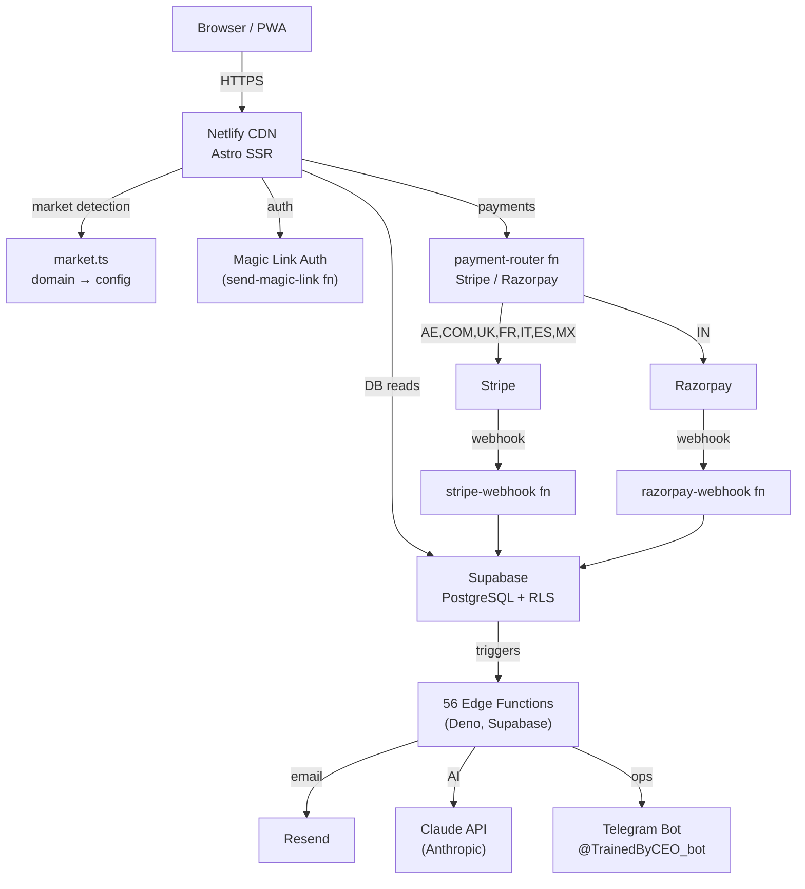

# TrainedBy — Architecture

## Overview

TrainedBy is a multi-market personal trainer discovery platform. One Supabase backend serves 10 domains across 4 languages. Trainers create profiles, capture leads, and sell subscription plans. The platform routes to the right locale, currency, and payment provider based on the domain.

## System Diagram



## Key Design Decisions

See `docs/decisions/` for full ADRs. Summary:

| Decision | Choice | Reason |
|----------|--------|--------|
| Frontend framework | Astro (SSR) | SSG-speed pages with server-side market detection |
| Database | Supabase (PostgreSQL) | RLS for multi-tenant data isolation, free tier viable |
| Backend | Deno edge functions | Runs at the edge, no cold starts, co-located with DB |
| Auth | Magic links | No password management, trainers are non-technical |
| Multi-market | 10 separate domains | Local SEO — `coachepar.fr` ranks in France, not `trainedby.ae/fr` |
| Payments | Stripe + Razorpay | Stripe for all markets except India (Razorpay required for INR) |

## Data Flow: Trainer Signup → First Lead

```
1. Trainer visits /join
   → Fills name, email, cert number
   → register-trainer edge function creates row in trainers table
   → send-magic-link sends OTP email via Resend

2. Trainer clicks magic link
   → verify-magic-link validates token, sets tb_session cookie
   → Redirected to /dashboard (SSR reads session, renders real data)

3. Trainer completes profile
   → Updates via update-trainer edge function
   → profile-completeness widget recalculates score SSR-side on next load

4. Consumer finds trainer at /[slug]
   → submit-lead creates row in leads table
   → lifecycle-email sends intro email to consumer + notification to trainer
   → agent-lead-responder AI crafts personalised follow-up (optional, Pro plan)
```

## Edge Function Architecture

56 edge functions across 4 categories:

| Category | Count | Examples |
|----------|-------|---------|
| Auth & registration | 4 | send-magic-link, verify-magic-link, register-trainer, verify-cert-upload |
| Payments | 6 | payment-router, create-checkout, stripe-webhook, razorpay-webhook, payout-coaches, connect-stripe |
| AI agents | 12 | agent-lead-responder, agent-content, agent-pricing, ceo-agent, meta-agent |
| Platform ops | 34 | submit-lead, update-trainer, growth-agent, weekly-stats, lifecycle-email |

All functions share `_shared/` utilities:
- `logger.ts` — structured logging to Supabase logs
- `sentry.ts` — error capture to Sentry
- `rate_limit.ts` — in-memory rate limiter per IP
- `errors.ts` — CORS headers
- `claude.ts` — Claude API client

## Security Model

- **RLS on all tables** — trainers can only read/write their own rows
- **Magic link tokens** — one-time, 10-minute expiry, stored in `magic_links` table
- **Webhook JWT disabled** — Stripe/Razorpay/Telegram webhooks validate via signature, not JWT
- **Idempotency** — `processed_webhook_events` table prevents double-processing payment webhooks
- **Rate limiting** — all public-facing edge functions limit by IP

## Infrastructure

| Service | Plan | Notes |
|---------|------|-------|
| Supabase | Pro | mezhtdbfyvkshpuplqqw |
| Netlify | Pro | Auto-deploys main → production |
| Sentry | Developer | Frontend + edge function error tracking |
| Resend | Scale | Transactional email |
| Stripe | Live | Subscription billing (AE, COM, UK, FR, IT, ES, MX) |
| Razorpay | Live | Subscription billing (IN) |
