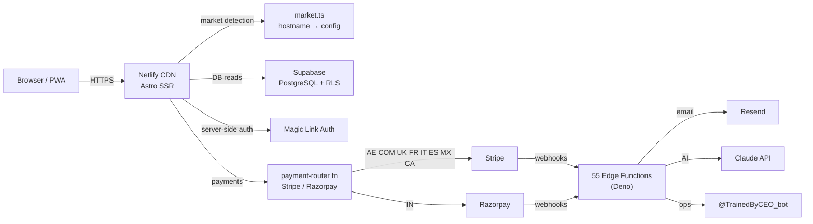

# TrainedBy

Personal trainer discovery platform. Trainers create a profile, capture leads, and sell subscription plans. Consumers find a trainer by market, specialty, and price — then pay directly.

**Live:** trainedby.ae · trainedby.com · coachepar.fr · allenaticon.it · entrenacon.com · trainedby.co.uk · trainedby.in · trainedby.mx · trainedby.es · trainedby.ca

---

## Architecture



**Stack:** Astro (SSR, Netlify adapter) · Supabase (PostgreSQL, RLS, Deno edge functions) · Stripe Connect · Razorpay · Resend · Claude API

See [ARCHITECTURE.md](ARCHITECTURE.md) for full technical design and rationale.

---

## Scope

| Dimension | Value |
|-----------|-------|
| Markets | 10 domains, 4 languages (EN, FR, IT, ES) |
| Payment providers | Stripe (9 domains) + Razorpay (India) |
| Edge functions | 55 (auth, payments, AI agents, platform ops) |
| Backend | One Supabase project serves all markets |

---

## How It Works

**1. Trainer signup**
Trainer fills name, email, cert number on `/join` → `register-trainer` edge function creates their row → `send-magic-link` sends a one-time login link via Resend.

**2. Profile build**
Trainer logs into `/dashboard` → completes profile (photo, bio, Instagram, packages, cert verification) → gamified completeness widget tracks progress.

**3. Lead capture**
Consumer finds trainer at `/[slug]` → fills lead form → `submit-lead` creates a `leads` row → `lifecycle-email` sends intro email to consumer + notification to trainer → optional AI follow-up via `agent-lead-responder`.

**4. Payment**
Trainer enables a plan → consumer subscribes → `payment-router` routes to Stripe or Razorpay based on market → webhook confirms payment → subscription activates.

---

## Key Technical Decisions

| Decision | Choice | Reason |
|----------|--------|--------|
| Frontend | Astro SSR | Zero JS on profile pages → Core Web Vitals → local SEO |
| Backend | Supabase Deno edge functions | Sub-ms DB latency, no cold starts, 2M req/month free |
| Auth | Magic links | No passwords, trainers are non-technical |
| Multi-market | 10 separate domains | `coachepar.fr` ranks in France; subpaths don't |
| Payments | Stripe + Razorpay | Razorpay required for INR; Stripe for everything else |

Full decision log: [docs/decisions/](docs/decisions/)

---

## Repository Map

```
src/
  pages/       — Astro pages (consumer + trainer dashboard + API routes)
  lib/         — market.ts, i18n.ts, supabase.ts
  components/  — Astro + React components
  layouts/     — Base.astro (head, OG, SW, analytics)
supabase/
  functions/   — 55 Deno edge functions
  migrations/  — All DB schema migrations
scripts/       — deploy_functions.sh, seed scripts
docs/
  decisions/   — Architecture Decision Records
  runbooks/    — Operational guides
  specs/       — Feature design specs
```

---

## Docs

- [ARCHITECTURE.md](ARCHITECTURE.md) — System design, data flows, security model
- [CONTRIBUTING.md](CONTRIBUTING.md) — Local setup, branching, edge function guide
- [docs/decisions/](docs/decisions/) — ADR log (why Astro, why edge functions, why multi-domain)
- [docs/runbooks/](docs/runbooks/) — Deployment, secrets, Sentry setup

---

## Infrastructure

| Service | Plan |
|---------|------|
| Supabase | Pro — `mezhtdbfyvkshpuplqqw` |
| Netlify | Pro — auto-deploys `main` to production |
| Sentry | Developer — frontend + edge function error tracking |
| Resend | Scale — transactional email |
| Stripe | Live — 9 domains |
| Razorpay | Live — India |
