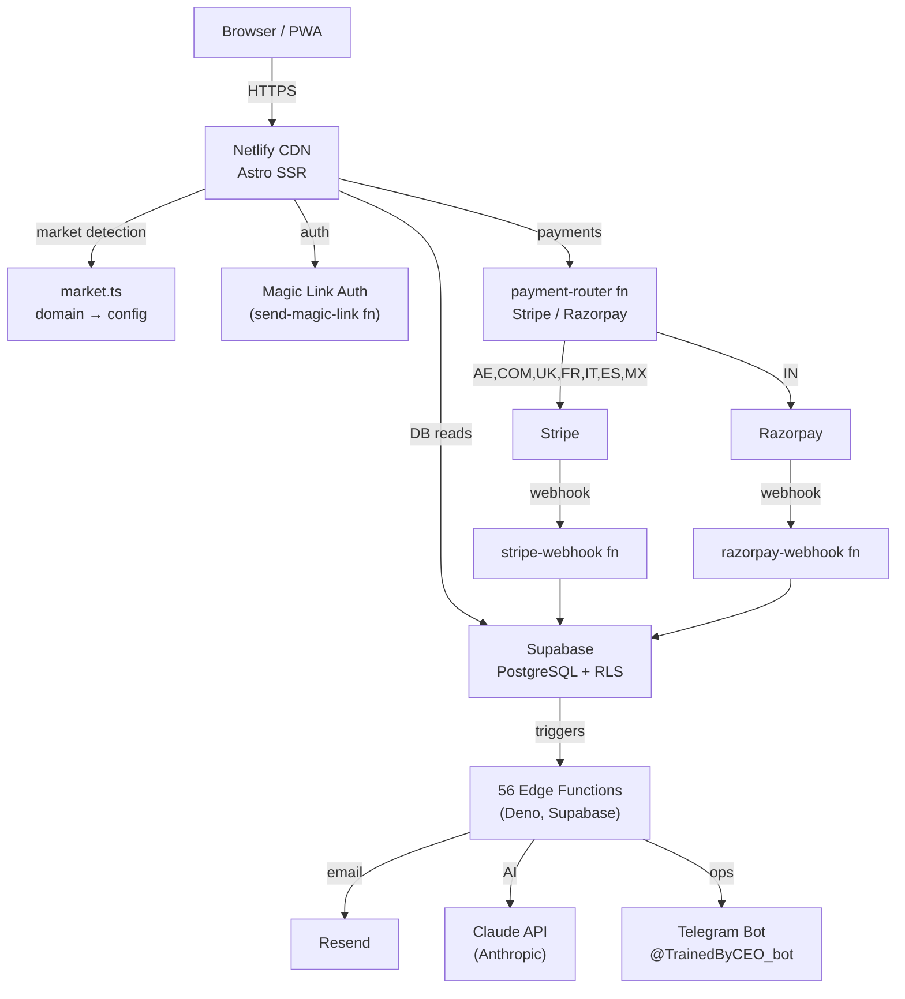

# Phase 1 — Foundation Implementation Plan

> **For agentic workers:** REQUIRED SUB-SKILL: Use superpowers:subagent-driven-development (recommended) or superpowers:executing-plans to implement this plan task-by-task. Steps use checkbox (`- [ ]`) syntax for tracking.

**Goal:** Make the platform observable and trustworthy — Sentry live on all surfaces, CI/CD blocking bad merges, and architecture documented with ADRs.

**Architecture:** Two GitHub Actions workflows handle CI (type-check + unit tests on every PR) and edge function deployment (on merge to staging). Sentry is already wired in code — only env vars are missing. All showcase docs (ARCHITECTURE.md, ADRs) are written to the repo root and `docs/decisions/`.

**Tech Stack:** GitHub Actions, pnpm, Astro, Sentry, Supabase CLI, Bash

---

## Task 1: CI Workflow

**Files:**
- Create: `.github/workflows/ci.yml`

- [ ] **Step 1: Create the CI workflow**

```yaml
# .github/workflows/ci.yml
name: CI

on:
  pull_request:
    branches: [staging, main]

concurrency:
  group: ci-${{ github.ref }}
  cancel-in-progress: true

jobs:
  check:
    name: Type-check, lint & test
    runs-on: ubuntu-latest
    steps:
      - uses: actions/checkout@v4

      - uses: pnpm/action-setup@v4
        with:
          version: 9

      - uses: actions/setup-node@v4
        with:
          node-version: 22
          cache: pnpm

      - name: Install dependencies
        run: pnpm install --frozen-lockfile

      - name: Astro type-check
        run: pnpm exec astro check

      - name: Unit tests (with coverage)
        run: pnpm test:ci
        env:
          CI: true
```

- [ ] **Step 2: Commit**

```bash
git add .github/workflows/ci.yml
git commit -m "ci: add CI workflow — type-check + unit tests on PRs"
```

---

## Task 2: Edge Function Deploy Workflow

**Files:**
- Create: `.github/workflows/edge-functions.yml`

- [ ] **Step 1: Create the edge functions deploy workflow**

```yaml
# .github/workflows/edge-functions.yml
name: Deploy Edge Functions

on:
  push:
    branches: [staging]
    paths:
      - 'supabase/functions/**'
      - 'scripts/deploy_functions.sh'

jobs:
  deploy:
    name: Deploy changed edge functions
    runs-on: ubuntu-latest
    steps:
      - uses: actions/checkout@v4

      - name: Setup Supabase CLI
        uses: supabase/setup-cli@v1
        with:
          version: latest

      - name: Deploy all edge functions
        run: |
          chmod +x scripts/deploy_functions.sh
          SUPABASE_ACCESS_TOKEN=${{ secrets.SUPABASE_ACCESS_TOKEN }} \
            ./scripts/deploy_functions.sh
        env:
          SUPABASE_ACCESS_TOKEN: ${{ secrets.SUPABASE_ACCESS_TOKEN }}

      - name: Verify JWT config
        run: |
          chmod +x scripts/deploy_functions.sh
          SUPABASE_ACCESS_TOKEN=${{ secrets.SUPABASE_ACCESS_TOKEN }} \
            ./scripts/deploy_functions.sh --verify-only
        env:
          SUPABASE_ACCESS_TOKEN: ${{ secrets.SUPABASE_ACCESS_TOKEN }}
```

- [ ] **Step 2: Commit**

```bash
git add .github/workflows/edge-functions.yml
git commit -m "ci: add edge function deploy workflow on staging push"
```

---

## Task 3: Add SUPABASE_ACCESS_TOKEN to GitHub Secrets (Manual)

This is a manual step — document it as a runbook.

**Files:**
- Create: `docs/runbooks/github-secrets.md`

- [ ] **Step 1: Create the runbook**

```markdown
# GitHub Secrets Setup

## Required secrets for CI/CD

Go to: GitHub repo → Settings → Secrets and variables → Actions → New repository secret

| Secret name | Where to get it | Used by |
|-------------|-----------------|---------|
| `SUPABASE_ACCESS_TOKEN` | Supabase Dashboard → Account → Access Tokens | `edge-functions.yml` |

## Verification

After adding the secret, push any change to `supabase/functions/` on the `staging` branch.
The `Deploy Edge Functions` workflow should appear in the Actions tab and succeed.
```

- [ ] **Step 2: Commit**

```bash
git add docs/runbooks/github-secrets.md
git commit -m "docs: add GitHub secrets setup runbook"
```

---

## Task 4: Sentry Setup Runbook

Sentry is already wired in `sentry.client.config.js` and `supabase/functions/_shared/sentry.ts`. Only the DSN env vars are missing.

**Files:**
- Create: `docs/runbooks/sentry-setup.md`

- [ ] **Step 1: Create the Sentry setup runbook**

```markdown
# Sentry Setup

## Status
Code is fully wired. Only env vars need to be set.

## Step 1 — Create a Sentry project
1. Go to sentry.io → New Project → JavaScript (Astro)
2. Note your DSN (format: `https://xxx@oNNN.ingest.sentry.io/NNN`)

## Step 2 — Set env vars in Netlify
Go to: Netlify → Site → Environment variables → Add

| Variable | Value |
|----------|-------|
| `PUBLIC_SENTRY_DSN` | Your Sentry DSN from step 1 |
| `SENTRY_AUTH_TOKEN` | Sentry → Settings → Auth Tokens → Create new token (scope: `project:releases`, `org:read`) |

Trigger a redeploy after setting these.

## Step 3 — Set env vars in Supabase
Go to: Supabase Dashboard → Project → Edge Functions → Manage secrets

| Secret | Value |
|--------|-------|
| `SENTRY_DSN` | Same DSN from step 1 |

## Step 4 — Smoke test (frontend)
1. Open trainedby.ae in a browser
2. Open DevTools Console
3. Run: `throw new Error("Sentry smoke test")`
4. Check Sentry dashboard → Issues → confirm the error appears within 30 seconds

## Step 5 — Smoke test (edge function)
1. Call the health edge function: `curl https://mezhtdbfyvkshpuplqqw.supabase.co/functions/v1/health`
2. Check Sentry dashboard → Issues for any edge function errors from the past hour

## Evidence
Screenshot the Sentry Issues page showing at least 1 event. Save it as `docs/runbooks/sentry-evidence.png`.
```

- [ ] **Step 2: Commit**

```bash
git add docs/runbooks/sentry-setup.md
git commit -m "docs: add Sentry setup runbook with smoke test instructions"
```

---

## Task 5: ARCHITECTURE.md

**Files:**
- Create: `ARCHITECTURE.md`

- [ ] **Step 1: Write ARCHITECTURE.md**

```markdown
# TrainedBy — Architecture

## Overview

TrainedBy is a multi-market personal trainer discovery platform. One Supabase backend serves 10 domains across 4 languages. Trainers create profiles, capture leads, and sell subscription plans. The platform routes to the right locale, currency, and payment provider based on the domain.

## System Diagram



## Key Design Decisions

See `docs/decisions/` for full ADRs. Summary:

| Decision | Choice | Reason |
|----------|--------|--------|
| Frontend framework | Astro (SSR) | SSG-speed pages with server-side market detection |
| Database | Supabase (PostgreSQL) | RLS for multi-tenant data isolation, free tier viable |
| Backend | Deno edge functions | Runs at the edge, no cold starts, co-located with DB |
| Auth | Magic links | No password management, trainers are non-technical |
| Multi-market | 10 separate domains | Local SEO — `coachepar.fr` ranks in France, not `trainedby.ae/fr` |
| Payments | Stripe + Razorpay | Stripe for all markets except India (Razorpay required for INR) |

## Data Flow: Trainer Signup → First Lead

```
1. Trainer visits /join
   → Fills name, email, cert number
   → register-trainer edge function creates row in trainers table
   → send-magic-link sends OTP email via Resend

2. Trainer clicks magic link
   → verify-magic-link validates token, sets tb_session cookie
   → Redirected to /dashboard (SSR reads session, renders real data)

3. Trainer completes profile
   → Updates via update-trainer edge function
   → profile-completeness widget recalculates score SSR-side on next load

4. Consumer finds trainer at /[slug]
   → submit-lead creates row in leads table
   → lifecycle-email sends intro email to consumer + notification to trainer
   → agent-lead-responder AI crafts personalised follow-up (optional, Pro plan)
```

## Edge Function Architecture

56 edge functions across 4 categories:

| Category | Count | Examples |
|----------|-------|---------|
| Auth & registration | 4 | send-magic-link, verify-magic-link, register-trainer, verify-cert-upload |
| Payments | 6 | payment-router, create-checkout, stripe-webhook, razorpay-webhook, payout-coaches, connect-stripe |
| AI agents | 12 | agent-lead-responder, agent-content, agent-pricing, ceo-agent, meta-agent |
| Platform ops | 34 | submit-lead, update-trainer, growth-agent, weekly-stats, lifecycle-email |

All functions share `_shared/` utilities:
- `logger.ts` — structured logging to Supabase logs
- `sentry.ts` — error capture to Sentry
- `rate_limit.ts` — in-memory rate limiter per IP
- `errors.ts` — CORS headers
- `claude.ts` — Claude API client

## Security Model

- **RLS on all tables** — trainers can only read/write their own rows
- **Magic link tokens** — one-time, 10-minute expiry, stored in `magic_links` table
- **Webhook JWT disabled** — Stripe/Razorpay/Telegram webhooks validate via signature, not JWT
- **Idempotency** — `processed_webhook_events` table prevents double-processing payment webhooks
- **Rate limiting** — all public-facing edge functions limit by IP

## Infrastructure

| Service | Plan | Notes |
|---------|------|-------|
| Supabase | Pro | mezhtdbfyvkshpuplqqw |
| Netlify | Pro | Auto-deploys main → production |
| Sentry | Developer | Frontend + edge function error tracking |
| Resend | Scale | Transactional email |
| Stripe | Live | Subscription billing (AE, COM, UK, FR, IT, ES, MX) |
| Razorpay | Live | Subscription billing (IN) |
```

- [ ] **Step 2: Commit**

```bash
git add ARCHITECTURE.md
git commit -m "docs: add ARCHITECTURE.md with system diagram and data flows"
```

---

## Task 6: ADR Log

**Files:**
- Create: `docs/decisions/001-astro-over-nextjs.md`
- Create: `docs/decisions/002-supabase-edge-functions.md`
- Create: `docs/decisions/003-multi-domain-architecture.md`

- [ ] **Step 1: Write ADR 001**

```markdown
# ADR 001 — Astro over Next.js

**Date:** 2025-12 (project start)
**Status:** Accepted

## Context

TrainedBy needs to serve trainer profile pages as the primary SEO surface. Each profile is a dedicated page (e.g., `trainedby.ae/sarah-al-mansoori`) that must rank in local search results. The pages are mostly static (trainer data changes infrequently) but need server-side market detection to serve the right locale and branding per domain.

## Decision

Use Astro with SSR output (Netlify adapter).

## Rationale

- **Performance:** Astro sends zero JS by default. Trainer profile pages are HTML + CSS. Core Web Vitals are excellent out of the box, which Google rewards.
- **SSR for market detection:** The `output: 'server'` mode lets us read `Astro.url.hostname` per request and select the right market config. This would require a custom server in Next.js.
- **Islands architecture:** The dashboard uses React islands for interactive components (profile completeness, bookings). The rest is server-rendered HTML.
- **Build simplicity:** One `astro build` produces everything. No separate API layer.

## Tradeoffs

- Next.js has a larger ecosystem and better ISR (incremental static regeneration). We accept this — our content update frequency doesn't require ISR.
- Astro's React integration requires `@astrojs/react` and adds complexity. We accept this — the dashboard interactivity requires it.
```

- [ ] **Step 2: Write ADR 002**

```markdown
# ADR 002 — Supabase Edge Functions over a Separate API Server

**Date:** 2025-12 (project start)
**Status:** Accepted

## Context

The platform needs backend logic for: trainer registration, lead capture, payment processing, AI-powered responses, and scheduled digests. Options were: a separate Node/Express server, Netlify Functions, Vercel Edge Functions, or Supabase Edge Functions.

## Decision

Use Supabase Deno Edge Functions for all backend logic.

## Rationale

- **Co-location:** Edge functions run in the same data centre as the database. Auth checks, DB queries, and responses happen with sub-millisecond DB latency.
- **No cold starts:** Supabase edge functions use Deno Deploy under the hood, which has no cold start problem (unlike Lambda or Netlify Functions in Node).
- **Cost at scale:** 2M function invocations/month free, then $2/million. A competitor on AWS Lambda at the same scale would cost ~$80/month.
- **Service role key access:** Functions run with full service role access to the DB, removing the need for a separate privileged backend. This is secure because functions are not exposed to the browser directly — they're called via the Supabase anon key gateway.

## Tradeoffs

- Deno is not Node.js. npm packages must be imported via esm.sh or deno.land/x. Some packages (e.g., PDFKit) have no Deno equivalent — we'd need a separate service for those.
- 56 functions is a large surface area to maintain. Mitigated by `_shared/` utilities and consistent patterns across all functions.
```

- [ ] **Step 3: Write ADR 003**

```markdown
# ADR 003 — Multi-Domain over Subdomain Architecture

**Date:** 2025-12 (project start)
**Status:** Accepted

## Context

TrainedBy operates across 8 markets: UAE, UK, India, US/Global, France, Italy, Spain, Mexico. Each market needs localised content, currency, and certification body references. Options were:
- One domain with locale subpaths (e.g., `trainedby.ae/fr/`)
- Subdomains (e.g., `fr.trainedby.ae`)
- Separate domains per market (e.g., `coachepar.fr`)

## Decision

Use separate domains per market, sharing one Supabase backend.

## Rationale

- **Local SEO:** `coachepar.fr` ranks in France as a French domain. `trainedby.ae/fr/` is seen by Google as an international site. For a local service (personal training), local SEO is the acquisition channel — this decision directly affects revenue.
- **Brand authenticity:** French trainers marketing themselves on a `.fr` domain builds trust with French clients. Same for Italy (`allenaticon.it`) and Spain (`entrenacon.com`).
- **One backend:** All 10 domains share `mezhtdbfyvkshpuplqqw.supabase.co`. The `market` column on the `trainers` table partitions data per domain. RLS policies enforce isolation.
- **Scalability:** Adding a new market takes 5 minutes — register the domain, add a row to `market.ts`, set the Netlify custom domain.

## Tradeoffs

- Managing 10 domains (SSL, DNS, Netlify) adds operational overhead. Mitigated by Netlify's automatic SSL and Supabase's single-backend model.
- Sitemap and robots.txt must be market-aware. Mitigated by the dynamic sitemap endpoint in `supabase/functions/sitemap/`.
```

- [ ] **Step 4: Commit**

```bash
git add docs/decisions/
git commit -m "docs: add ADR log (001 Astro, 002 edge functions, 003 multi-domain)"
```

---

## Verification

- [ ] Open a test PR to `staging` — confirm CI workflow runs and passes in the Actions tab
- [ ] Confirm Astro type-check passes: `pnpm exec astro check`
- [ ] Confirm unit tests pass: `pnpm test:ci`
- [ ] Confirm ARCHITECTURE.md renders correctly on GitHub (Mermaid diagram)
- [ ] Confirm `docs/decisions/` has 3 ADR files
