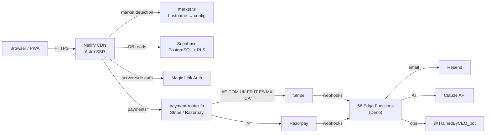

# Phase 3 — Showcase Layer Implementation Plan

> **For agentic workers:** REQUIRED SUB-SKILL: Use superpowers:subagent-driven-development (recommended) or superpowers:executing-plans to implement this plan task-by-task. Steps use checkbox (`- [ ]`) syntax for tracking.

**Goal:** Make the repo itself a compelling artifact — a cold reader understands the product, architecture, and founder thinking in under 5 minutes.

**Architecture:** All deliverables are documentation files. README.md is the entry point (investor-facing). CONTRIBUTING.md is the onboarding guide (hire-facing). METRICS.md is a live snapshot queried from Supabase. docs/ restructure organises existing files into a coherent hierarchy.

**Tech Stack:** Markdown, Mermaid, Supabase CLI (for metrics query), Bash

---

## Task 1: README.md — Technical Memo

**Files:**
- Modify: `README.md`

- [ ] **Step 1: Replace README.md with the technical memo**

```markdown
# TrainedBy

Personal trainer discovery platform. Trainers create a profile, capture leads, and sell subscription plans. Consumers find a trainer by market, specialty, and price — then pay directly.

**Live:** trainedby.ae · trainedby.com · coachepar.fr · allenaticon.it · entrenacon.com · trainedby.co.uk · trainedby.in · trainedby.mx · trainedby.es · trainedby.ca

---

## Architecture



**Stack:** Astro (SSR, Netlify adapter) · Supabase (PostgreSQL, RLS, Deno edge functions) · Stripe Connect · Razorpay · Resend · Claude API

See [ARCHITECTURE.md](ARCHITECTURE.md) for full technical design and rationale.

---

## Scope

| Dimension | Value |
|-----------|-------|
| Markets | 10 domains, 4 languages (EN, FR, IT, ES) |
| Payment providers | Stripe (9 markets) + Razorpay (India) |
| Edge functions | 56 (auth, payments, AI agents, platform ops) |
| Backend | One Supabase project serves all markets |

---

## How It Works

**1. Trainer signup**
Trainer fills name, email, cert number on `/join` → `register-trainer` edge function creates their row → `send-magic-link` sends a one-time login link via Resend.

**2. Profile build**
Trainer logs into `/dashboard` → completes profile (photo, bio, Instagram, packages, cert verification) → gamified completeness widget tracks progress.

**3. Lead capture**
Consumer finds trainer at `/[slug]` → fills lead form → `submit-lead` creates a `leads` row → `lifecycle-email` sends intro email to consumer + notification to trainer → optional AI follow-up via `agent-lead-responder`.

**4. Payment**
Trainer enables a plan → consumer subscribes → `payment-router` routes to Stripe or Razorpay based on market → webhook confirms payment → subscription activates.

---

## Key Technical Decisions

| Decision | Choice | Reason |
|----------|--------|--------|
| Frontend | Astro SSR | Zero JS on profile pages → Core Web Vitals → local SEO |
| Backend | Supabase Deno edge functions | Sub-ms DB latency, no cold starts, 2M req/month free |
| Auth | Magic links | No passwords, trainers are non-technical |
| Multi-market | 10 separate domains | `coachepar.fr` ranks in France; subpaths don't |
| Payments | Stripe + Razorpay | Razorpay required for INR; Stripe for everything else |

Full decision log: [docs/decisions/](docs/decisions/)

---

## Repository Map

```
src/
  pages/       — Astro pages (consumer + trainer dashboard + API routes)
  lib/         — market.ts, i18n.ts, supabase.ts
  components/  — Astro + React components
  layouts/     — Base.astro (head, OG, SW, analytics)
supabase/
  functions/   — 56 Deno edge functions
  migrations/  — All DB schema migrations
scripts/       — deploy_functions.sh, seed scripts
docs/
  decisions/   — Architecture Decision Records
  runbooks/    — Operational guides
  specs/       — Feature design specs
```

---

## Docs

- [ARCHITECTURE.md](ARCHITECTURE.md) — System design, data flows, security model
- [CONTRIBUTING.md](CONTRIBUTING.md) — Local setup, branching, edge function guide
- [docs/decisions/](docs/decisions/) — ADR log (why Astro, why edge functions, why multi-domain)
- [docs/runbooks/](docs/runbooks/) — Deployment, secrets, Sentry setup

---

## Infrastructure

| Service | Plan |
|---------|------|
| Supabase | Pro — `mezhtdbfyvkshpuplqqw` |
| Netlify | Pro — auto-deploys `main` to production |
| Sentry | Developer — frontend + edge function error tracking |
| Resend | Scale — transactional email |
| Stripe | Live — 9 markets |
| Razorpay | Live — India |
```

- [ ] **Step 2: Commit**

```bash
git add README.md
git commit -m "docs: rewrite README as technical memo for investor/hire cold-read"
```

---

## Task 2: CONTRIBUTING.md — Future Hires Guide

**Files:**
- Create: `CONTRIBUTING.md`

- [ ] **Step 1: Create CONTRIBUTING.md**

```markdown
# Contributing to TrainedBy

Everything a new engineer needs to go from zero to shipping.

---

## Local Setup

You need: Node 22, pnpm 9, Supabase CLI, Deno.

```bash
# 1. Clone
git clone https://github.com/your-org/trainedby.git
cd trainedby

# 2. Install frontend deps
pnpm install

# 3. Copy env template and fill in values
cp .env.example .env.local
# Required: PUBLIC_SUPABASE_URL, PUBLIC_SUPABASE_ANON_KEY

# 4. Start Supabase locally
supabase start
# This starts PostgreSQL, Auth, Edge Functions runtime on localhost

# 5. Run migrations
supabase db push

# 6. Start the frontend
pnpm dev
# Astro starts at http://localhost:4321
```

Verify: open `http://localhost:4321` — you should see the TrainedBy homepage for the `ae` market (default when running on localhost).

---

## Project Structure

| Path | What lives here |
|------|-----------------|
| `src/pages/` | Astro pages — one file per route. `[slug].astro` = trainer profile. `dashboard.astro` = trainer dashboard. `og/[slug].png.ts` = OG image API route. |
| `src/lib/market.ts` | **Source of truth for all market config.** Locale, currency, cert body, payment provider, domain. If it's market-specific, it goes here. |
| `src/lib/i18n.ts` | Translation strings. Keys are in English; values are per-locale translations. |
| `src/lib/supabase.ts` | Supabase client factory. Use `createServerClient()` in Astro pages, `createBrowserClient()` in React components. |
| `src/layouts/Base.astro` | Shared HTML shell — head, OG tags, service worker registration, analytics. All pages use this. |
| `src/components/` | Astro components (SSR) and React islands (interactive). |
| `supabase/functions/` | 56 Deno edge functions. Each is a self-contained directory with `index.ts`. |
| `supabase/functions/_shared/` | Shared utilities used across edge functions. |
| `supabase/migrations/` | All schema changes as timestamped SQL files. |
| `scripts/deploy_functions.sh` | **Always use this to deploy edge functions** — never `supabase functions deploy` directly. |

---

## Branching

This project uses simplified GitFlow.

```
main        — production (trainedby.ae etc.)
staging     — pre-production UAT
feat/*      — new features → PR against staging
fix/*       — bug fixes → PR against staging
hotfix/*    — critical production fixes → PR against main, then cherry-pick to staging
```

**Standard workflow:**

```bash
# 1. Branch from staging
git checkout staging && git pull
git checkout -b feat/your-feature

# 2. Build, test, commit
# 3. Open PR against staging
gh pr create --base staging

# 4. After staging UAT → PR from staging → main
```

Never push directly to `main`.

---

## Making a Change

### Frontend (Astro page or component)

```bash
# Type-check
pnpm exec astro check

# Unit tests
pnpm test

# Dev server
pnpm dev
```

### Database schema change

Always through migrations — never edit the DB directly.

```bash
# Create a new migration
supabase migration new your_migration_name

# Edit the generated file in supabase/migrations/
# Then apply locally
supabase db push

# Verify your migration works, then commit the file
git add supabase/migrations/
git commit -m "db: your migration description"
```

### Edge function

Each edge function lives in `supabase/functions/<function-name>/index.ts`.

**Development:**

```bash
# Serve a single function locally
supabase functions serve <function-name> --env-file .env.local

# Run tests (Deno)
cd supabase/functions/<function-name>
deno test --allow-net --allow-env
```

**Shared utilities** (`_shared/`):
- `logger.ts` — structured logging. Use this, not `console.log`.
- `sentry.ts` — error capture. Import and call `captureException()` in catch blocks.
- `errors.ts` — CORS headers. Every function needs CORS on OPTIONS.
- `claude.ts` — Claude API client. Use for all AI calls.
- `rate_limit.ts` — IP rate limiter. Wire this on all public-facing functions.

**Deployment:**

```bash
# Always use the wrapper script
SUPABASE_ACCESS_TOKEN=<token> ./scripts/deploy_functions.sh <function-name>

# Verify JWT config after deploy
SUPABASE_ACCESS_TOKEN=<token> ./scripts/deploy_functions.sh --verify-only

# Webhook functions (ceo-agent, stripe-webhook, razorpay-webhook, academy-booking-webhook)
# must have verify_jwt = false — the deploy script enforces this.
```

---

## Market Config

`src/lib/market.ts` is the source of truth for every market-specific setting:

```typescript
// Adding a new market: add one entry to the MARKETS object
{
  key: 'au',
  domain: 'trainedby.com.au',
  locale: 'en-AU',
  currency: 'AUD',
  currencySymbol: 'A$',
  certBody: 'Fitness Australia',
  paymentEnabled: true,
  stripe: true,
}
```

Never hardcode market-specific logic outside this file.

---

## Testing

```bash
# Unit tests (Vitest)
pnpm test

# Unit tests with coverage
pnpm test:ci

# Type-check (Astro)
pnpm exec astro check

# E2E tests (Playwright — requires dev server running)
pnpm exec playwright test
```

CI runs `astro check` and `pnpm test:ci` on every PR to `staging`.

---

## Secrets

All secrets live in Supabase Edge Function secrets — never in source files.

```bash
# Set a secret (production)
supabase secrets set SECRET_NAME=value --project-ref mezhtdbfyvkshpuplqqw

# List secrets
supabase secrets list --project-ref mezhtdbfyvkshpuplqqw
```

Local dev: use `.env.local` (gitignored). Never commit `.env` files.

---

## Runbooks

- [docs/runbooks/github-secrets.md](docs/runbooks/github-secrets.md) — CI/CD secrets setup
- [docs/runbooks/sentry-setup.md](docs/runbooks/sentry-setup.md) — Sentry DSN and smoke test
- [docs/runbooks/stripe-prices.md](docs/runbooks/stripe-prices.md) — Adding a new Stripe price ID
- [docs/runbooks/seed-cohort.md](docs/runbooks/seed-cohort.md) — White-glove trainer onboarding
```

- [ ] **Step 2: Commit**

```bash
git add CONTRIBUTING.md
git commit -m "docs: add CONTRIBUTING.md — local setup, branching, edge function guide"
```

---

## Task 3: METRICS.md — Live Snapshot

**Files:**
- Create: `METRICS.md`

This file is a manually-updated snapshot. The values below are placeholders — update them by querying Supabase before committing.

- [ ] **Step 1: Query current metrics from Supabase**

```bash
# Run each of these in the Supabase SQL editor (mezhtdbfyvkshpuplqqw)
# or via supabase db query

# Trainer count
SELECT COUNT(*) FROM trainers;

# Leads captured
SELECT COUNT(*) FROM leads;

# Markets with at least one trainer
SELECT COUNT(DISTINCT market) FROM trainers WHERE avatar_url IS NOT NULL;

# Edge functions deployed
supabase functions list --project-ref mezhtdbfyvkshpuplqqw | wc -l
```

- [ ] **Step 2: Create METRICS.md with live values**

```markdown
# TrainedBy — Platform Metrics

*Updated: 2026-05-04. Query Supabase to refresh.*

---

## Platform

| Metric | Value |
|--------|-------|
| Markets live | 10 domains |
| Languages | 4 (EN, FR, IT, ES) |
| Payment providers | 2 (Stripe, Razorpay) |
| Edge functions deployed | 56 |

## Traction

| Metric | Value |
|--------|-------|
| Trainer profiles | [query: SELECT COUNT(*) FROM trainers] |
| Leads captured | [query: SELECT COUNT(*) FROM leads] |
| Active markets (≥1 trainer) | [query: SELECT COUNT(DISTINCT market) FROM trainers] |

## Infrastructure

| Service | Plan | Region |
|---------|------|--------|
| Supabase | Pro | ap-southeast-1 |
| Netlify | Pro | Global CDN |
| Sentry | Developer | US |
| Resend | Scale | Global |

## Performance

*Run Lighthouse on https://trainedby.ae to refresh.*

| Page | LCP | CLS | FCP |
|------|-----|-----|-----|
| Trainer profile | — | — | — |
| /join | — | — | — |
| /dashboard | — | — | — |

## How to Refresh

```bash
# Trainer count
supabase db query "SELECT COUNT(*) FROM trainers" --project-ref mezhtdbfyvkshpuplqqw

# Leads count
supabase db query "SELECT COUNT(*) FROM leads" --project-ref mezhtdbfyvkshpuplqqw
```
```

- [ ] **Step 3: Commit**

```bash
git add METRICS.md
git commit -m "docs: add METRICS.md with platform snapshot and refresh instructions"
```

---

## Task 4: docs/ Restructure

**Files:**
- Move existing files into correct directories
- Verify `docs/decisions/`, `docs/runbooks/`, `docs/specs/` exist with correct content

The restructure just verifies the directories are in place — the files within them are created by Phases 1, 2, and 3 tasks.

- [ ] **Step 1: Verify directory structure**

```bash
ls docs/decisions/
# Expected: 001-astro-over-nextjs.md  002-supabase-edge-functions.md  003-multi-domain-architecture.md

ls docs/runbooks/
# Expected: github-secrets.md  sentry-setup.md  stripe-prices.md

ls docs/specs/
# If this directory doesn't exist, create it
mkdir -p docs/specs

ls docs/superpowers/
# Expected: specs/  plans/  (existing GSD artefacts)
```

- [ ] **Step 2: Move any misplaced specs**

```bash
# If docs/superpowers/specs/ contains files that should be in docs/specs/,
# move only the non-GSD design docs (brainstorming outputs for product features)
# Leave GSD planning docs (2026-*.md files) in docs/superpowers/

# Example: if a product feature spec is in the wrong place
# mv docs/superpowers/specs/some-product-feature.md docs/specs/

# After Phase 1 and 2 complete, docs/ should look like:
# docs/
#   decisions/    — ADR log (001, 002, 003)
#   runbooks/     — github-secrets, sentry-setup, stripe-prices, seed-cohort, launch-verification
#   specs/        — product feature specs (non-GSD)
#   superpowers/  — GSD specs and plans
```

- [ ] **Step 3: Add docs/specs/.gitkeep if empty**

```bash
touch docs/specs/.gitkeep
git add docs/specs/.gitkeep
git commit -m "docs: create docs/specs/ directory for product feature specs"
```

---

## Task 5: Self-Review Commit

- [ ] **Step 1: Verify all showcase files exist**

```bash
# All of these should exist and have real content
ls -la README.md CONTRIBUTING.md METRICS.md ARCHITECTURE.md
ls -la docs/decisions/
ls -la docs/runbooks/
```

- [ ] **Step 2: Check README Mermaid renders on GitHub**

Open the README.md on GitHub in a browser. The Mermaid diagram should render as a visual graph, not as a code block. If it shows raw text, verify the triple-backtick mermaid block is correctly closed.

- [ ] **Step 3: Cold-read README**

Read README.md top to bottom as if you are seeing this project for the first time. Verify:
- Product is clear in the first 2 sentences
- Architecture diagram is readable
- How It Works section explains the full flow
- All links in the Docs section point to real files

---

## Verification

- [ ] `README.md` — cold read takes < 5 minutes, Mermaid diagram renders on GitHub
- [ ] `CONTRIBUTING.md` — local setup in < 10 commands, edge function guide present
- [ ] `METRICS.md` — platform metrics section filled with real values from Supabase
- [ ] `docs/decisions/` — 3 ADR files present (from Phase 1)
- [ ] `docs/runbooks/` — at minimum `github-secrets.md` and `sentry-setup.md` present (from Phase 1)
- [ ] `docs/specs/` — directory exists
